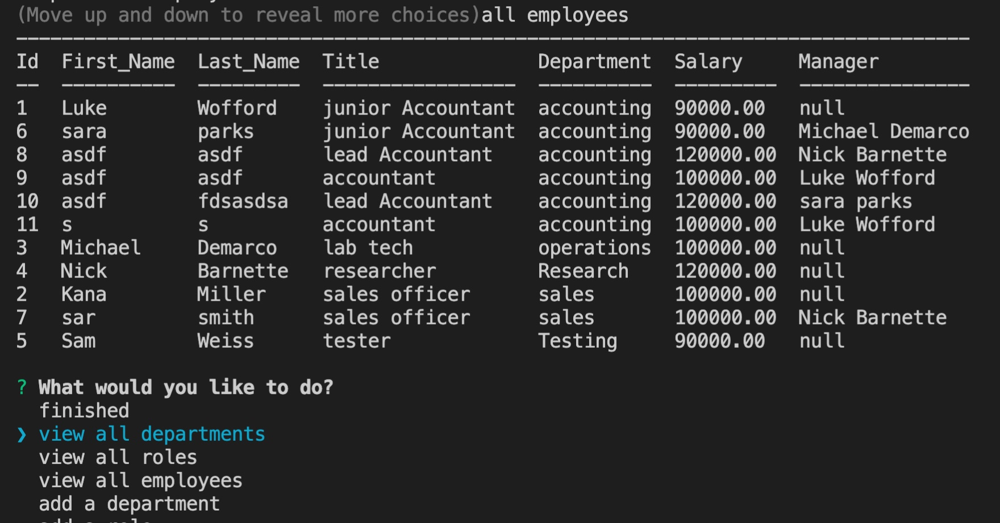

# 12 SQL: Employee Tracker

## User Story

```md
AS A business owner
I WANT to be able to view and manage the departments, roles, and employees in my company
SO THAT I can organize and plan my business
```

## Demo Link
The following video shows an example of the application being used from the command line:
[Youtube Video of employee tracker](https://youtu.be/LoXNKCw9OVs)

## Mock-Up


